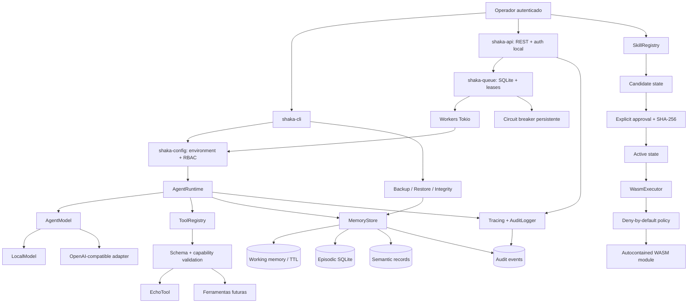

# Arquitetura do Shaka

## 1. Objetivo arquitetural

O Shaka é organizado como um agente de execução de tarefas com **evolução governada pelo operador**. Ele pode interpretar um objetivo, consultar ferramentas autorizadas, registrar a execução e sugerir extensões, mas não pode alterar ou promover suas próprias capacidades sem intervenção humana autorizada.

A arquitetura separa contratos, persistência, execução dinâmica, orquestração e operação. Essa separação reduz acoplamento e permite trocar o provedor de modelo ou a tecnologia de persistência sem espalhar dependências pelo núcleo.

## 2. Diagrama de componentes

## 3. Workspace e responsabilidades

| Crate | Responsabilidade | Dependências de infraestrutura |
|---|---|---|
| `shaka-core` | Tipos de tarefa, tenant, operador, ferramenta, capacidade, skill e auditoria. | Nenhuma externa de runtime. |
| `shaka-memory` | Persistência SQLite, TTL de memória de trabalho, episódios, consolidação semântica e eventos de auditoria. | SQLite embutido. |
| `shaka-skills` | Catálogo, estados, aprovação, revogação e persistência JSON de skills. | Filesystem local para catálogo. |
| `shaka-sandbox` | Compilação/instanciação do módulo Wasmtime, limite de fuel e rejeição de imports. | Wasmtime; sem WASI no MVP. |
| `shaka-orchestrator` | Abstração de modelo, function calling, validação pré-execução, orçamento e registro de execução. | Tokio, HTTP opcional para provedor de modelo. |
| `shaka-observability` | Inicialização de tracing e gravação de eventos de auditoria. | `tracing` e SQLite via `shaka-memory`. |
| `shaka-cli` | Interface operacional, RBAC, tarefas, memória, skills, backup, restore, auditoria, doctor e `serve`. | Clap e filesystem local. |
| `shaka-config` | Configuração tipada, validação de ambiente, provedor, credenciais e modo live. | URL/Serde e políticas do núcleo. |
| `shaka-queue` | Sessões, fila priorizada, idempotência, leases, retry, cancelamento persistente e circuit breaker. | SQLite embutido e Tokio host. |
| `shaka-api` | Rotas REST, autenticação Bearer opcional, workers, integração com runtime e auditoria. | Axum, Tokio e crates do Shaka. |

## 4. Fluxo de execução de uma tarefa

1. O operador inicia uma tarefa com tenant, identidade de operador e objetivo.
2. O runtime cria um `TaskEnvelope` com orçamento, deadline e modo `dry_run`.
3. O modelo recebe somente o system prompt do host, o objetivo e as definições de ferramentas permitidas.
4. Se o modelo propõe uma ferramenta, o host procura a definição no `ToolRegistry`.
5. A entrada é validada pelo JSON Schema, a capacidade requerida é comparada ao conjunto concedido e o efeito colateral é avaliado.
6. Em `dry_run`, efeitos externos não são executados. Ferramentas somente leitura podem continuar em execução controlada.
7. O resultado e o resumo da execução são gravados na memória episódica.
8. Tracing fornece correlação por tarefa; auditoria registra efeitos relevantes em cadeia de hashes por tenant.
9. Na API, `shaka-queue` persiste a tarefa com chave de idempotência, prioridade e lease antes de responder `202`.
10. Um worker faz claim transacional, executa o runtime com cancelamento cooperativo e persiste sucesso, falha, retry ou cancelamento.
11. Reinicialização recupera leases expirados; o circuit breaker pode manter tarefas em `queued` até a janela de recuperação.

## 5. Três camadas de memória

### 5.1 Memória de trabalho

A memória de trabalho é associada a `tenant_id` e `task_id`, com chave, valor e `expires_at`. O TTL impede que o contexto operacional cresça indefinidamente. Ela é adequada para dados intermediários e não deve ser tratada como fonte permanente de verdade.

### 5.2 Memória episódica

Cada execução gera um episódio com tipo, conteúdo resumido, resultado, custo estimado, tempo e timestamp. O armazenamento tem índice por tenant e data. O comando de expurgo remove episódios anteriores à retenção especificada.

### 5.3 Memória semântica

A consolidação é explícita e associada a um episódio de origem. O MVP mantém registros semânticos versionados, mas ainda não gera embeddings nem faz ranking vetorial. Essa limitação é intencional: primeiro se estabelece proveniência, retenção e governança; depois se adiciona recuperação semântica.

## 6. Fronteiras de confiança

| Fronteira | Regra do MVP |
|---|---|
| Modelo → host | Saída do modelo é dado não confiável e não executa diretamente. |
| Modelo → ferramenta | Passa por nome conhecido, schema, capacidade, orçamento e modo dry-run. |
| Skill → processo principal | Não existe execução de código da skill dentro do processo principal. |
| WASM → host | Imports são rejeitados; não há WASI, rede ou filesystem. |
| Operador → promoção | A promoção exige hash SHA-256, justificativa e identidade de operador. |
| Memória → tenant | Todas as tabelas de negócio carregam tenant; a release possui teste de isolamento e verificação explícita. |
| Conteúdo web → instruções | A futura camada web deve preservar a origem e tratar o conteúdo como não confiável. |

## 7. Concorrência

O runtime usa Tokio para chamadas assíncronas ao modelo e às ferramentas. A conexão SQLite é protegida por `parking_lot::Mutex`, permitindo que o `MemoryStore` seja compartilhado por tarefas sem expor a conexão diretamente. Locks são mantidos somente durante operações locais de persistência; chamadas externas não ocorrem sob o lock.

A v0.5.0 oferece múltiplos workers Tokio em um processo, com claim transacional, prioridade, leases, retry, cancelamento cooperativo e circuito de falhas. O SQLite continua protegido por mutex e WAL; chamadas externas nunca ocorrem sob o lock. Escala horizontal, quotas distribuídas e subagentes com DAG permanecem fora do escopo.

## 8. Decisões fora do MVP

A arquitetura deixa pontos de extensão para:

- busca vetorial e híbrida;
- subagentes paralelos com DAG, budget por filho e falha parcial;
- adaptadores de Telegram, Discord, Slack e WhatsApp Business API;
- pesquisa web com marcação de conteúdo não confiável;
- WASI Preview 2 ou componentes WASM com interfaces explícitas;
- assinatura e verificação de artefatos (implementada para skills na v0.4.0);
- RBAC/ABAC, multi-tenancy forte e cofre de segredos;
- métricas Prometheus e exportação OTLP.

Essas extensões só devem ser ativadas depois de seus contratos e threat model serem registrados em ADRs.
