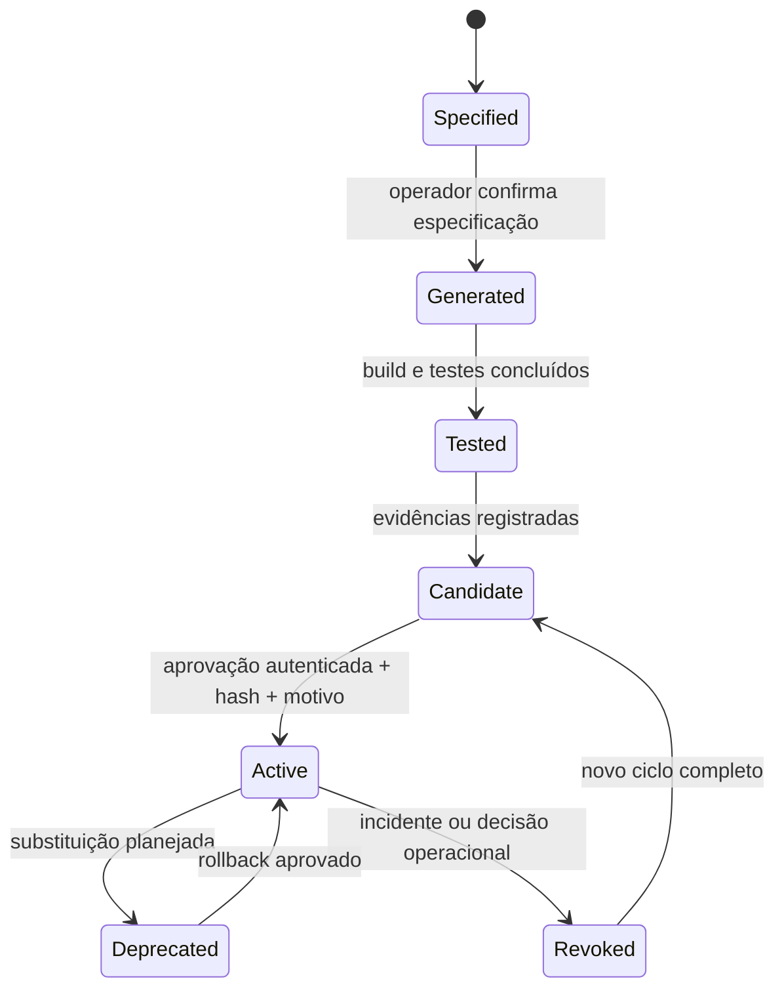

# Governança de Skills

## 1. Princípio central

O Shaka pode sugerir que uma capacidade repetitiva merece uma skill, mas não pode criar, promover ou ativar essa skill sozinho. A evolução é **acionada e aprovada pelo operador**.

> Não existe caminho de auto-promoção. Uma taxa de sucesso, uma sugestão do modelo ou uma repetição de tarefa nunca substitui aprovação humana.

## 2. Máquina de estados

## 3. Fluxo normativo

### 3.1 Necessidade

O operador descreve a necessidade em comando explícito. O agente pode ajudar a produzir a especificação, mas deve apresentar interface, permissões, custo estimado, entradas, saídas e riscos antes de gerar artefato.

### 3.2 Especificação

A especificação deve incluir nome, versão SemVer, finalidade, schema de entrada, schema de saída, capabilities, limites de recursos, dependências, dados acessados, critérios de sucesso e casos adversariais.

### 3.3 Geração e build

O código gerado deve ser tratado como não confiável. O build precisa ocorrer fora do processo principal, sem segredos, com dependências fixadas e limite máximo de tentativas de correção. O MVP registra candidatas, mas ainda não fornece o pipeline completo de geração/compilação automática.

### 3.4 Testes

A skill precisa ser testada em happy path, entradas inválidas, limites, falhas, ausência de capability, tentativa de import do host, tentativa de rede/filesystem e repetição. Testes gerados pela IA não substituem testes fixos independentes.

### 3.5 Candidata

Após build e testes, o artefato recebe hash e entra no estado `Candidate`. Candidata não deve ser exposta ao agente como skill ativa nem receber dados reais.

### 3.6 Aprovação

A aprovação exige operador identificado, hash SHA-256 completo, justificativa e revisão das permissões. A aprovação deve ser registrada junto da versão e do artefato exato. Em ambiente de maior risco, aplicar revisão por duas pessoas.

### 3.7 Ativa

A skill ativa pode ser descoberta pelo runtime somente dentro das capabilities aprovadas. Todas as execuções devem registrar versão, hash, tenant, tarefa, duração, resultado, erro e custo.

### 3.8 Revogação e rollback

Revogação deve ser imediata e impedir novas execuções. Rollback significa reativar uma versão anterior que já tenha sido aprovada, não editar o artefato ativo manualmente. O rollback precisa preservar a timeline e a justificativa da decisão.

## 4. Capabilities

Cada skill declara somente o mínimo necessário:

| Capability | Exemplo de uso | Padrão |
|---|---|---|
| `MemoryWrite` | Registrar resultado de tarefa | Permitida somente por contrato explícito |
| `Network` | Chamar API externa | Negada |
| `FilesystemRead` | Ler arquivo delimitado | Negada |
| `FilesystemWrite` | Criar artefato | Negada |
| `CodeExecution` | Executar código dinâmico | Negada fora do sandbox |
| `ExternalMessaging` | Enviar mensagem | Negada |

Permissões compostas devem ser justificadas. O MVP rejeita uma combinação de rede e mensageria no registro simples para evitar escalada silenciosa de impacto.

## 5. Métricas de sucesso

A taxa de sucesso deve ser calculada por versão, tenant/escopo autorizado, janela temporal e definição de sucesso registrada. A skill nova deve aparecer como `sem histórico suficiente`, e não como uma taxa artificial de zero ou cem por cento.

A amostra deve distinguir sucesso funcional, falha de validação, timeout, violação de capability, erro externo e cancelamento. Uma mudança de versão reinicia ou versiona a série histórica.

## 6. Regras de bloqueio

A ativação deve ser bloqueada quando o hash estiver ausente ou divergente, o operador não estiver autenticado, o motivo estiver vazio, o status não for `Candidate`, os testes adversariais faltarem, a skill pedir capability não aprovada ou o artefato não puder ser reproduzido.

## 7. Implementação presente no MVP

`shaka-skills` persiste o catálogo em `data/skills.json`, registra candidatas, exige SHA-256 e justificativa para aprovação e permite revogação de uma skill ativa. O catálogo ainda não executa artefatos WASM nem implementa uma fila de build/correção; esses itens estão documentados como evolução e não devem ser inferidos como já disponíveis.
